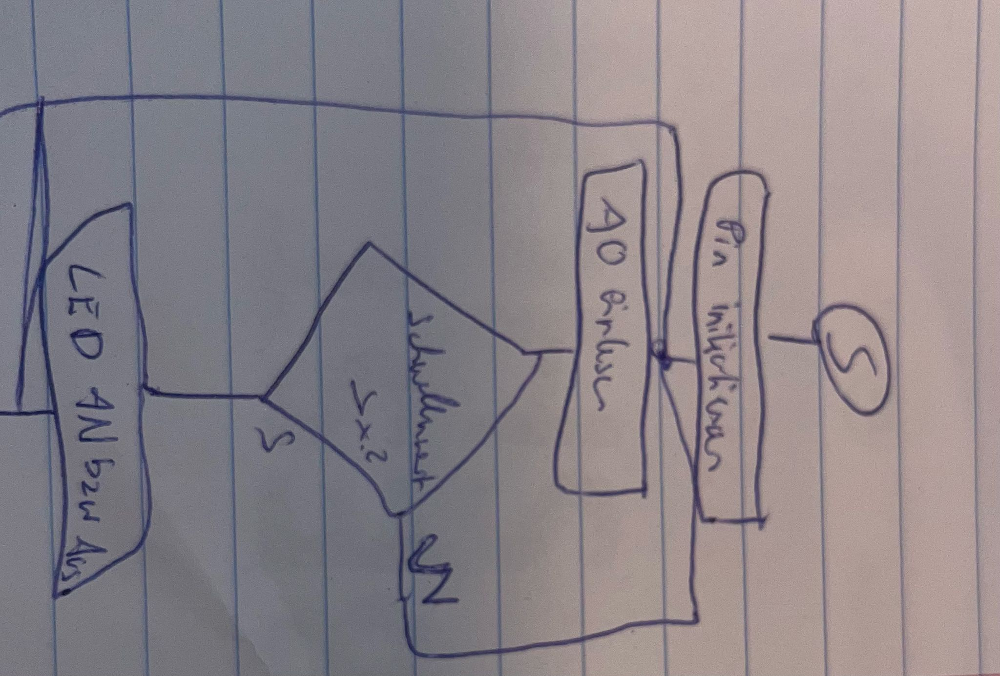
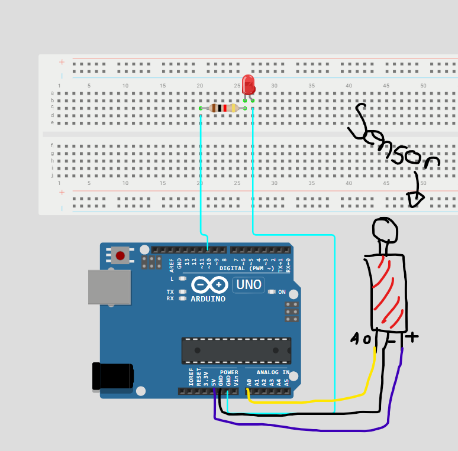
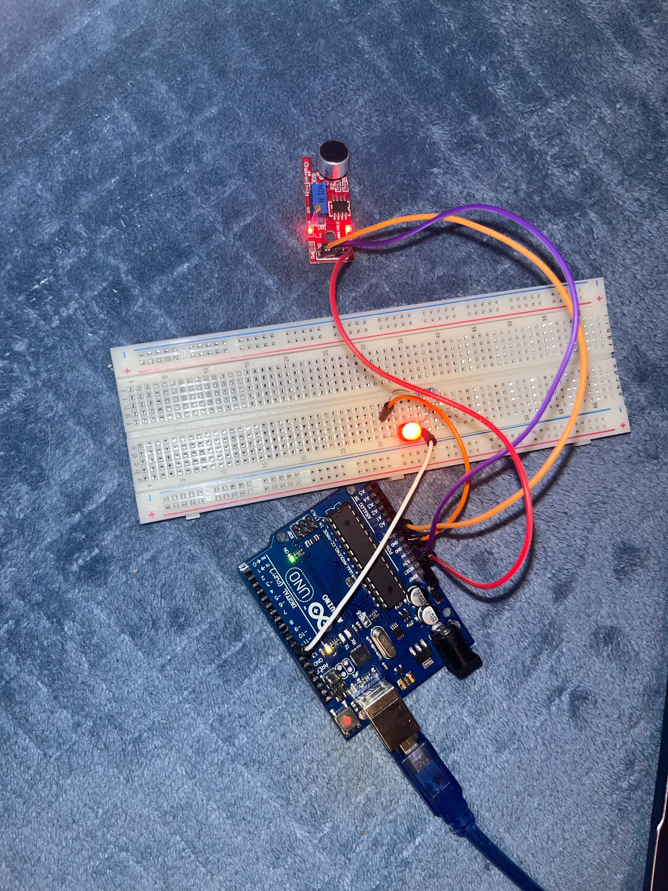

# CLap Switch

This project implements a simple LED control system using an Arduino and a sound sensor. A single LED is turned on and off by an acoustic signal – such as a clap. The sound detector is connected to an analog input on the Arduino. As soon as a sound exceeds a defined threshold, the Arduino toggles the state of the LED. The project demonstrates, in a simple way, how to process audio signals from a sensor and directly control outputs with Arduino – making it ideal for beginners in microcontroller programming and sensor integration.
## Flowchart

## Circuit diagram

## Photo of the final setup

## Video

Through this project, I gained valuable hands-on experience working with Arduino and sensors. I learned how to read analog input from a sound sensor and use it to control a digital output, like turning an LED on or off. I also understood the importance of debouncing using timing functions like millis() to prevent multiple triggers from a single sound. Additionally, I practiced implementing simple logic to toggle states and saw how inputs and outputs interact in real-time. 

## Bill of materials

Arduino Uno 
Breadboard
1x Led
1x Sound Sensor Module
Arduino Uno
Jump Wires

## Code
